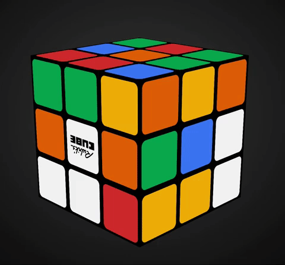

# rubiks-cube
An algorithm that solves a Rubik’s Cube.

# Introduction
This program scrambles and then solves a Rubik's Cube.

For an online virtual Rubik's Cube go to the following link: https://math.byu.edu/~doud/FastRubik/

There is an input field at the top of the webpage where you can first input the "Scramble" sequence, then click "Turn", then after it is done scrambling, input the "Solution" sequence.

Note: I did not design the online Rubik's Cube animation found at that link

# Group Theory
One of the challenges of this project was finding a convenient way to number the different faces of the Rubik's Cube. The faces were numbered using the mathematical principle of modular congruence. This allowed us to idenitfy what type of piece we were working with (middle edge, corner, etc).

